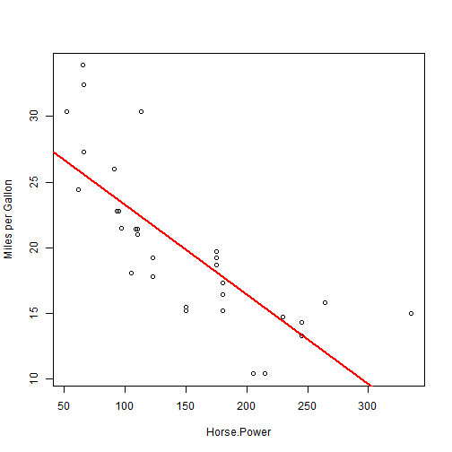
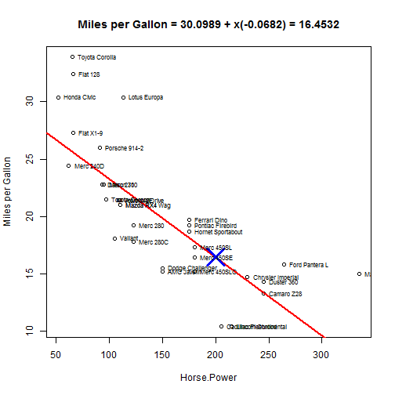

## Linear Regression App Tutorial

This is a tutorial on how to use the "Linear Regression App".

For this app we use the dataset mtcars and estimate the Miles per Gallon using a simple Linear Regression Model according to different variables.


```r
head(mtcars)
```

```
##                    mpg cyl disp  hp drat    wt  qsec vs am gear carb
## Mazda RX4         21.0   6  160 110 3.90 2.620 16.46  0  1    4    4
## Mazda RX4 Wag     21.0   6  160 110 3.90 2.875 17.02  0  1    4    4
## Datsun 710        22.8   4  108  93 3.85 2.320 18.61  1  1    4    1
## Hornet 4 Drive    21.4   6  258 110 3.08 3.215 19.44  1  0    3    1
## Hornet Sportabout 18.7   8  360 175 3.15 3.440 17.02  0  0    3    2
## Valiant           18.1   6  225 105 2.76 3.460 20.22  1  0    3    1
```

---

## Select a Predictor Variable

1- The first step is to select the predictor variable. This variable will be used to build the linear regression to predict the estimated miles per gallon.

The plot and the regression model will be automatically updated to our selection.

For example, try to choose the "Horse.Power" variable and you should get the following graph.

 

---

## Make your prediction

2- The next step is to write a specific value for our prediction.

The point will be automatically predicted and ploted in our graph.

For example, try predicting the miles per gallon using 200HP. The answer will be: 16MPG as shown in the graph.


 

---

## Add features

3- At last we can add or remove features. For example, use the formula checkbox to see the model formula and the value of the prediction made. We can also show or hide the regression line and we can also show the names of the regression values.

Example, try checking out all the boxes. You will see the formula with our prediction, the regression line, and the car names as the plot shown. In the app you will also see a table with car names and values(which I ommited here because of restricted space).

 

--- 

## Interactive App

We are now ready to take a look and play with the app. :)

You can go to the following link to start playing.
https://marcelo.shinyapps.io/Shiny3/

If you want to take a look at the code, you can access the following github repository.
https://github.com/MarceloOrtiz/shinnycode

---


